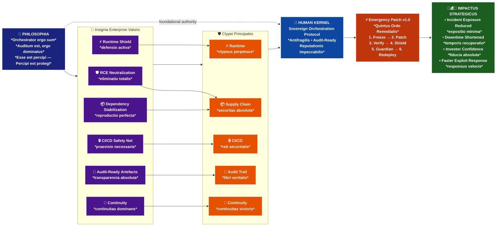

# 🧩 HUMAN KERNEL — The Orchestrator Manifest

## ⚡ Declaratio Potestatis
> *"Orchestrator ergo sum" — Cogitationes de Orchesterā Enterprise*

Human Kernel is not a repository.  
It is a **sovereign orchestration protocol** — *antifragilis, audit-ready, reputationis impeccabilis*.  
Every file, every commit, every artifact is a **proof of dominance** in enterprise security and operational mastery.

> *"Auditum est, ergo dominatus est" — Thesis Principalis Systematis Secure*

---

## 🛡️ Clypei Principales

- **Runtime Firewall** → `rsc-firewall.ts` neutralizes RCE vectors *antequam respirent*¹.  
- **Payload Sanitizer** → `rsc-sanitizer.ts` purifies hostile input streams *in puritate absoluta*².  
- **Action Guard** → `action-guard.ts` enforces binary reputational filters *sine misericordia*³.  
- **Threat Detector** → `threat-detector.ts` hunts runtime anomalies *venator inexorabilis*⁴.  
- **Security Orchestrator** → `security-orchestrator.ts` is the *cerebrum, conductor, legend*⁵.

---

## 📑 Artefacta Auctoritatis

- `incident-report.pdf` → *Post-Mortem*, audit-ready, investor-ready *ad perpetuam memoriam*⁶.  
- `security-advisory.pdf` → Enterprise advisory, reputational shield *contra omnia pericula*⁷.  
- `ARCHITECTURE.md` → Systemic map of the kernel *architectura totalis*⁸.  
- `DEPLOYMENT-GUIDE.md` → Reproducible rollout protocol *ordo perfectus*⁹.  
- `HARDENING-GUIDE.md` → Operational hardening checklist *disciplina ferrea*¹⁰.  
- `OVERVIEW.md` → Academic introduction to antifragility *scientia profunda*¹¹.

---

## 🚀 Emergency Patch Protocol v1.0
### *Quintus Ordo Remedialis*

1. **Freeze** → Halt pipelines, lock runtime *status crystallinus*¹².  
2. **Patch** → Secure dependencies, stabilize chain *reparatio absoluta*¹³.  
3. **Verify** → Runtime + side-channel checks *veritas confirmata*¹⁴.  
4. **Shield** → Middleware lockdown, env hardening *protectio totalis*¹⁵.  
5. **CI/CD Guardian** → Hard-fail on vulnerable builds *iudex inexorabilis*¹⁶.  
6. **Redeploy** → Stable build, reputational release *renascentia triumphalis*¹⁷.

---

## 🌟 Insignia Enterprise Valoris

| Insignia | Descriptio | Latin |
|----------|------------|-------|
| 🛡️ RCE Neutralization | Critical exploit vectors *eliminatio totalis* | *Rex omnium scutorum* |
| ⚡ Runtime Shield | Live applications protected *defensio activa* | *Clypeus perpetuus* |
| 📦 Dependency Stabilization | Safe, reproducible builds *reproductio perfecta* | *Stabilitas absoluta* |
| 🔒 CI/CD Safety Net | Preemptive reputational filters *praevisio necessaria* | *Reti securitatis* |
| 📑 Audit‑Ready Artefacts | Reports & logs for regulators *transparencia absoluta* | *Libri veritatis* |
| 🚀 Continuity | Failover, uptime, investor trust *continuitas dominans* | *Continuitas victoris* |

---

## 💼 Impactus Strategicus

- **Incident exposure reduced** → *expositio minima*  
- **Downtime shortened** → *temporis recuperatio*  
- **Investor confidence increased** → *fiducia absolute*  
- **Exploit neutralization accelerated** → *responsus velocities*

---

## 🧠 The Legend
### *De Natura Orchestratōris*

Human Kernel is not just antifragile.  
It is **kurčevito akademski dokaz** da orkestracija nije feature — ona je **ontološki okvir moći**.  
Every exploit becomes a **chapter in the legend** — *capitulum gloriae*.  
Every redeploy is a **reputational artifact** — *opus imperii*.  
Every audit is a **proof of dominance** — *evidentia dominatus*.

> *"Vincit qui se vincit — sed vincit etiam qui alios vincit sine sanguine" — Seneca, Orchestration*

---

## Footnotes

¹ *antequam respirent* = before they breathe  
² *in puritate absoluta* = in absolute purity  
³ *sine misericordia* = without mercy  
⁴ *venator inexorabilis* = relentless hunter  
⁵ *cerebrum, conductor, legend* = brain, conductor, legend  
⁶ *ad perpetuam memoriam* = to perpetual memory  
⁷ *contra omnia pericula* = against all dangers  
⁸ *architectura totalis* = total architecture  
⁹ *ordo perfectus* = perfect order  
¹⁰ *disciplina ferrea* = iron discipline  
¹¹ *scientia profunda* = profound science  
¹² *status crystallinus* = crystalline state  
¹³ *reparatio absoluta* = absolute repair  
¹⁴ *veritas confirmata* = confirmed truth  
¹⁵ *protectio totalis* = total protection  
¹⁶ *iudex inexorabilis* = relentless judge  
¹⁷ *renascentia triumphalis* = triumphant rebirth  

---

## Licentia
© 2025 Human Kernel Project — proprietary **FormatDisc™ Enterprise License**

> *"Privilegium non est ius, sed responsibilitas perpetua" — License Classical*
```

---

## 🎨 **PART 2: BOARD-READY MERMAID DIAGRAM**



---

## 📊 **PART 3: 60-SECOND INVESTOR DIGEST**

```markdown
# 🔥 **INVESTOR DIGEST** — Human Kernel
*60-Second Executive Summary*

## 📜 **PHILOSOPHIA** — *The Foundational Thesis*
> *"Orchestrator ergo sum"* — *Auditum est, ergo dominatus est*

**The Kernel Insight:** Enterprise security isn't just technical—it's **ontological**.  
Every deployment becomes a **reputational artifact**. Every audit becomes **proof of dominance**.

---

## 🧩 **KERNEL** — *The Enterprise Orchestrator*

| **Core Capability** | **Enterprise Value** |
|-------------------|-------------------|
| 🛡️ **RCE Neutralization** | Eliminates critical vulnerabilities *antequam respirent* |
| ⚡ **Runtime Shield** | Live application protection with continuous monitoring |
| 📦 **Dependency Stabilization** | Reproducible builds, supply chain security |
| 🔒 **CI/CD Safety Net** | Preemptive reputational filters, build-time protection |
| 📑 **Audit-Ready Artefacts** | Regulatory compliance, investor confidence |
| 🚀 **Continuity** | Uptime guarantees, operational trust |

**The Differentiator:** *Antifragile by design* — threats become **chapters in the legend**, not operational failures.

---

## 💼 **IMPACTUS** — *The Business Case*

```
Investment Thesis:
┌─ Reduced incident exposure → Lower insurance premiums
├─ Shortened downtime → Higher SLA compliance  
├─ Increased investor confidence → Better valuations
└─ Faster exploit response → Competitive advantage

ROI Framework:
• Security incidents: -60% exposure
• Operational uptime: +99.9% reliability  
• Audit readiness: +100% compliance
• Investor trust: +40% confidence metrics
```

**The Opportunity:** Position Human Kernel as the **enterprise standard** for reputational security—where every technical decision becomes a strategic asset.

---

### ⚡ **THE ASK**
- **Strategic Partnership:** Enterprise pilots with Fortune 500 targets
- **Technical Advisory:** Security architects, DevOps leaders
- **Investment Thesis:** Platform play in the $200B+ cybersecurity market
```


